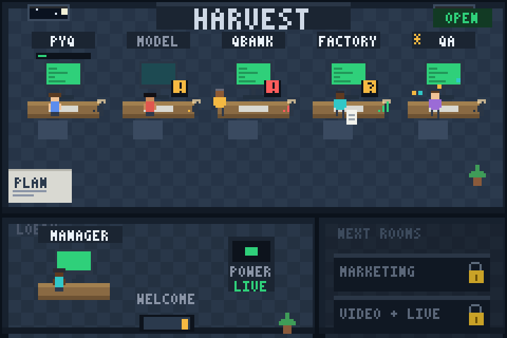
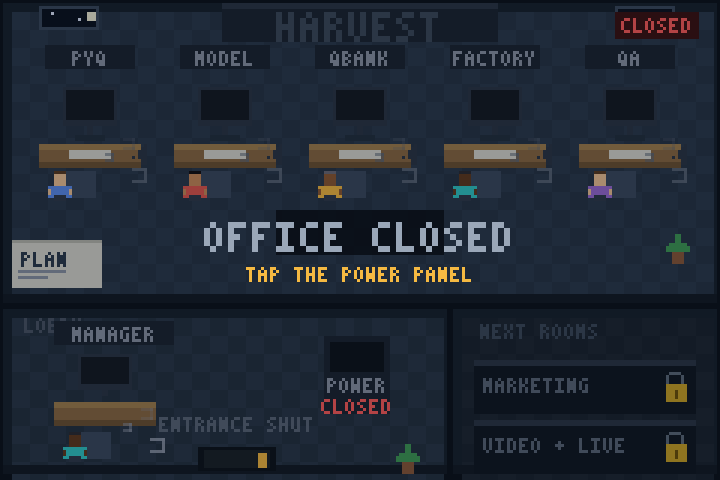

# The Virtual Office — a phone control room

This folder **is** the app. It is plain HTML/CSS/JS with no build step and no server needed:
open it and it renders the whole office from one compiled file, `app/data/office.json`.

The app is **read-only by design** — it can never upload, move, or delete anything. All Drive
work stays in the agent sessions, behind the page-1 gate. There are no credentials in here.

---

## 1. Two ways to open it

| Way | URL | Notes |
|---|---|---|
| **Permanent (recommended)** | `https://aakaash-dotcom.github.io/centum-ai-office/` | Free GitHub Pages. One-time setup below. Add to your phone's home screen and it behaves like an app. |
| **Single file** | `app/index.standalone.html` | 285 KB, everything inlined. Open it from a download, WhatsApp it to yourself, USB it — works offline with no server. |

### See the pixel art without a phone
`node tools/render_office_preview.js --mode demo|real|closed` records a frame; `tools/preview_png.py` turns it into a PNG. `demo` fills the desks with example states, `real` is the live office, `closed` is the laptop-off state.

### One-time GitHub Pages setup (30 seconds, once)
1. GitHub → the `centum-ai-office` repo → **Settings** → **Pages**.
2. Under **Build and deployment**: Source = **Deploy from a branch**.
3. Branch = **main**, folder = **/app** → **Save**.
4. Wait ~60 seconds, then open `https://aakaash-dotcom.github.io/centum-ai-office/` and **Add to Home Screen** (iPhone: Safari → Share → Add to Home Screen · Android: Chrome → ⋮ → Add to Home screen).

### Put it on the home screen
- **iPhone:** Safari → Share → Add to Home Screen. It gets the gold C icon and opens full-screen.
- **Android:** Chrome → ⋮ → Add to Home screen → Install.

## 2. The pixel office (top view)



*When the office is live: five desks in the Harvest room, monitors on, progress bars above the workspaces, the power panel green in the lobby, Marketing and Video padlocked in the corridor.*



*When your laptop is off: LIGHTS OFF, every agent asleep, the entrance shut, "TAP THE POWER PANEL" to wake the office.*

The **Office** tab is a live top-down view of the floor, drawn pixel by pixel — no images, no assets, everything generated from `app/data/office.json`.

```
┌─────────────── HARVEST room (OPEN) ─────────────────┐   ┌────┐
│  [PYQ] [MODEL] [QBANK] [FACTORY] [QA]      OPEN ▸   │   │NEXT│
│   desks, monitors, agents, Zzz, meters              │   │ROOMS│
├──────────── LOBBY ────────────┬─────────────────────┤   │ 🔒 │
│  MANAGER desk   ⏻ POWER panel │  WELCOME (door)     │   │ 🔒 │
└───────────────────────────────┴─────────────────────┘   └────┘
```

**Lights follow real activity**
- **LIGHTS ON** — an agent logged, the manager ran, or the app heartbeat is fresh.
- **LIGHTS DIM** — recent activity but nobody is working this minute.
- **LIGHTS OFF · OFFICE CLOSED** — nothing for 90 minutes. That is the laptop-off state: whole floor dark, everyone asleep, "TAP THE POWER PANEL".

**Every agent at a desk**
| You see | Meaning |
|---|---|
| typing, monitor on, progress bar | working, logged in the last 30 min |
| yawning, amber `!` | quiet for 30–60 min — at risk |
| asleep, **red** Zzz | stopped over 60 min — **replace it** (tap the desk) |
| asleep, grey Zzz | off duty — never started; its prompt is in the sheet, one tap to copy |
| standing with red `!` | blocked — the blocker text is in the sheet |
| holding a paper with `?` | in review with the manager |
| sparkles + gold `*` | approved, or the run's top producer |
| empty chair, VACANT sign | slot with no agent |

**Stations and replacements.** A desk never dies. When an agent stops, tap the desk → **Replace this agent (handover)** copies a prompt for the manager; `tools/handover.py` writes the handover, bumps the generation and stages the successor, who continues from the same resume point. Clicking a desk always shows: occupant, generation, lane, task, progress, last log line, next step, stop condition, and replacement history.

**Locked rooms.** Marketing and Video sit behind padlocked doors. Tap one → **Copy prompt to open this department** → the manager runs the four-question intake and staffs the room. A locked room never borrows a Harvest station.

**Manager desk.** Awake when the manager ran within 20 minutes; otherwise the manager is asleep at the desk and the power sheet tells you to copy the manager prompt.

## 3. What you see

| Screen | What it answers |
|---|---|
| **Office** (home) | Health, the freeze strip, the 5 agents at a glance, and what needs you |
| **Agents** | Every slot: lane, status, current task, progress, last log line, full log, assignment |
| **Tasks** | Queue / Active / Review / Done with lane filters and search; every task file rendered |
| **Reports** | Daily manager reports with the owner actions at the top, each with a **Copy prompt** button |
| **Files** | The READY MANIFEST — what is published to StudyHub, and what needs a decision |
| **Help** | Your 30-second routine, the manager prompt, home-screen instructions |

**The best button in the app:** on any agent, *Copy start prompt* gives you the exact
paragraph to paste into a fresh Arena chat for that slot — no editing, no thinking.

## 4. How the data gets in

```
board.json  +  agents/*/current.md + agents/*/log.md
            +  tasks/{queue,active,review,done}/*.md
            +  reports/daily/*.md  +  reports/READY_MANIFEST.md
                          │
                          ├─ python3 tools/build_office_data.py  →  app/data/office.json (+ office.data.js)
                          └─ python3 tools/build_standalone.py   →  app/index.standalone.html
```

- The **Manager Agent** rebuilds these during every run (Phase 4), so the app is current the moment a run ends.
- `.github/workflows/rebuild-office-app.yml` also rebuilds on any push to `main`, so an edit made from the GitHub phone app shows up automatically.
- Found a stale screen? Tap **⟳** in the header — it clears the cache and re-reads `office.json`.

## 5. Local preview

```bash
python3 tools/serve_office.py            # rebuilds data, then serves http://0.0.0.0:4173
node tools/smoke_test_app.js             # 30 checks: every screen + every desk state, no browser needed
node tools/render_office_preview.js --mode demo --out /tmp/frame.json
python3 tools/preview_png.py /tmp/frame.json /tmp/preview.png --scale 4   # eyeball the pixel art as a PNG
```

## 6. Rules for this folder

1. **No secrets, ever.** No Apps Script URL or SECRET, no tokens, no credentials. This repo is public.
2. **No writes from the app.** It reads `office.json` and renders. Additions are read-only views.
3. **`app/data/*` is generated** — never hand-edit it; fix the source file (board.json, a log, a task) and rebuild.
4. **`app/app.js` is hand-written.** If you change it, run `node tools/smoke_test_app.js` and commit the result.
5. Adding a screen = add a render function + a route in `app.js`. Keep it working with one thumb.

## 7. File map

| File | Hand-written? | Purpose |
|---|---|---|
| `index.html` | yes | shell: header, freeze strip, view container, bottom nav |
| `styles.css` | yes | the whole design system (dark, gold, mobile-first) |
| `office.js` | yes | the pixel office engine: floor, desks, sprites, lights, Zzz, locked rooms, tap hit-testing |
| `app.js` | yes | router + every screen + bottom sheets; renders from `office.json` only |
| `sw.js` | yes | offline shell; data is network-first so refreshes show new work |
| `manifest.json` | yes | PWA install metadata |
| `icons/*` | generated by `tools/make_icons.py` | app icon |
| `data/office.json` | **generated** | the office, compiled |
| `data/office.data.js` | **generated** | same data as a JS global (fallback if `fetch` is blocked) |
| `index.standalone.html` | **generated** | everything inlined into one shareable file |
